

  

<h1 align="center">Nunya for phones</h1>

  The phone app of <a href="https://github.com/nunyavpn/nunya">Nunya</a>, a VPN client for
  <a href="https://github.com/nunyavpn/nunya-core">nunya-core</a>. Android first, iOS after.

  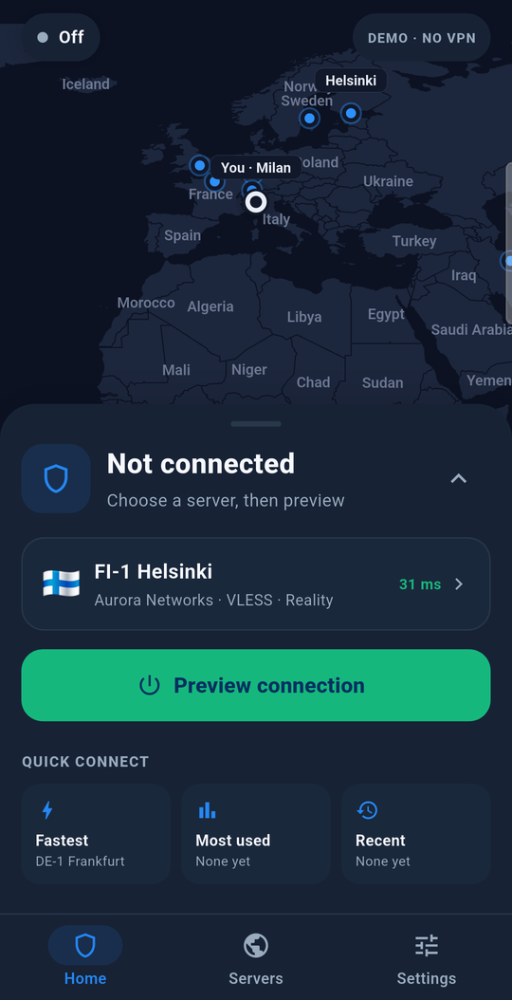
  &nbsp;
  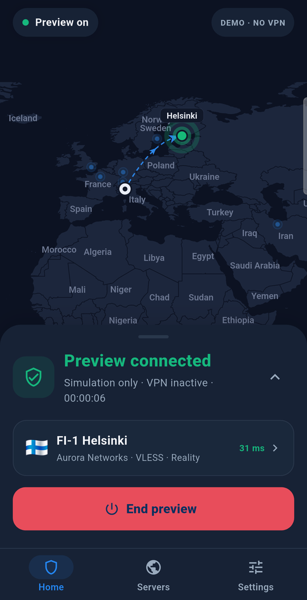
  &nbsp;
  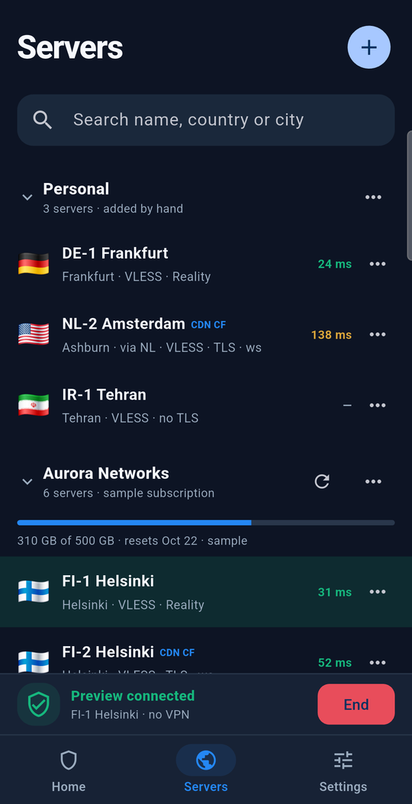

> [!IMPORTANT]
> **This is a preview, not a VPN yet.** Every screen works, on sample servers, but no tunnel runs
> and no traffic is routed. Connecting is simulated, and the app says so wherever it shows a
> connection: "Preview connected · Simulation only · VPN inactive". The native tunnel and the Xray
> engine come next.

## What works today

| | In the preview | Still to come |
| --- | --- | --- |
| **Connecting** | The whole flow: the VPN permission explained first, connecting, connected with a timer, failure, disconnecting | A real tunnel, through Android's `VpnService` and an iOS packet tunnel extension |
| **Map** | The desktop app's world map, offline, with your location, server dots you can tap, and the route while connected | |
| **Servers** | Add by link, QR code (camera or image) or form; edit, share, usage, delete | Subscriptions; saving between launches |
| **Links** | `vless://`, `vmess://`, `trojan://`, `wireguard://`, read and written by a port of the desktop's parser | WireGuard configs (`wg-quick`) |
| **Settings** | Bypass rules, DNS, ad and tracker blocking, diagnostics, locked while connected | Applying them: block lists are not downloaded and no engine config is built yet |

Servers, edits and settings live in memory until protected storage is added. Usage history is
simulated, since no tunnel carries anything to count.

## A tour

### Connecting

The connection is a sheet over the map. Before the first connection, the app explains the VPN
permission Android is about to ask for. While connected, the map draws the route from you to the
exit, and dragging the sheet up shows traffic and addresses.

  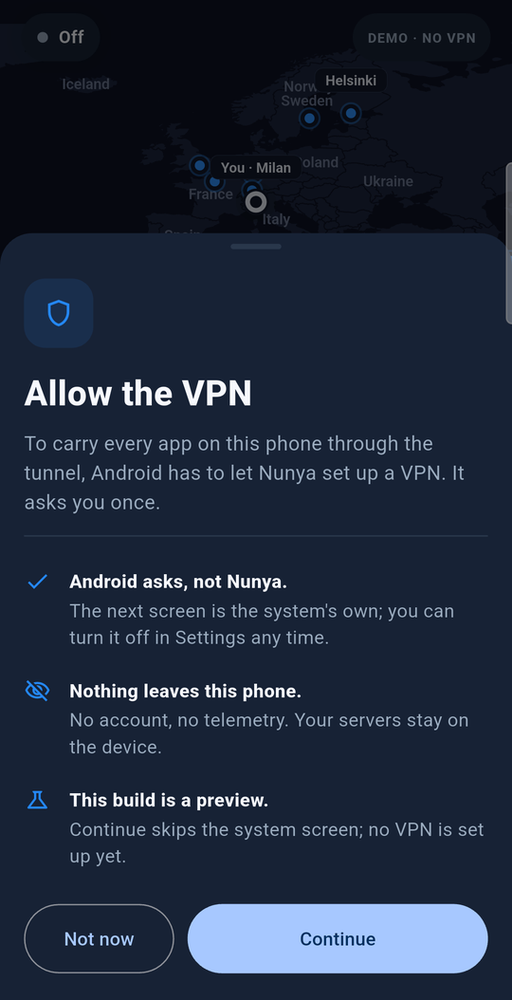
  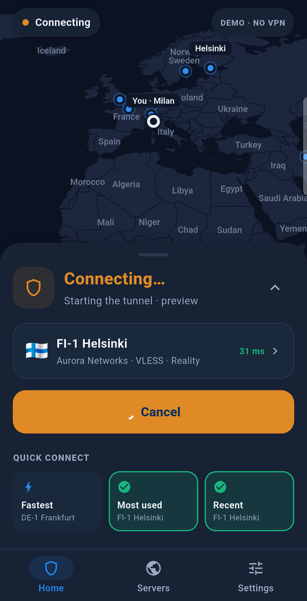
  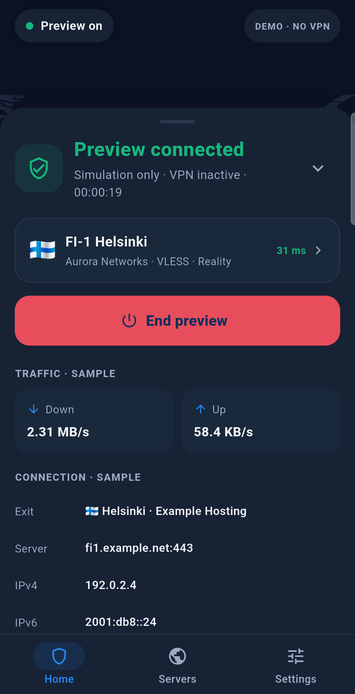
  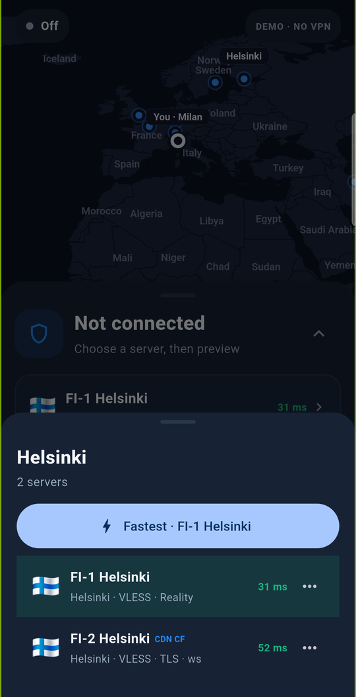

The map is a port of the desktop's: Natural Earth borders shipped with the app (nothing is fetched
from a map server), pinch and drag, and server dots that can be tapped. A dot with one server picks
it; a dot with several opens them in a sheet, with a button for the fastest. Your own dot comes from a
geo-IP lookup and opens your public address and provider.

### Servers

Every server has a menu: connect, check, usage, share, edit and delete. Editing is a form over the
server's settings rather than a link to retype, and sharing writes a fresh link and QR code from
them, so edits are what gets shared.

  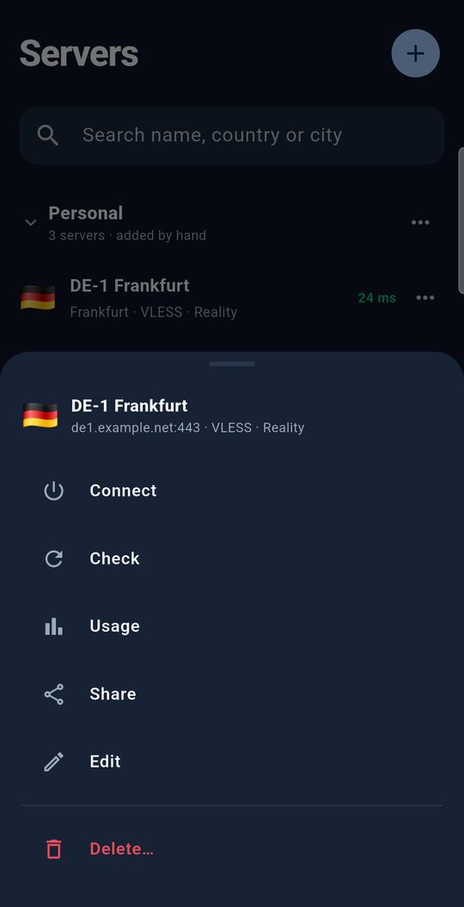
  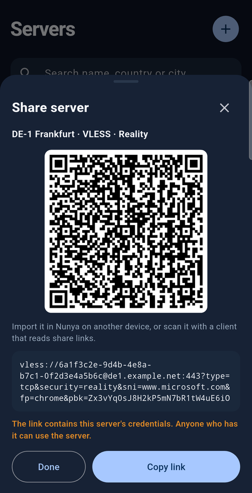
  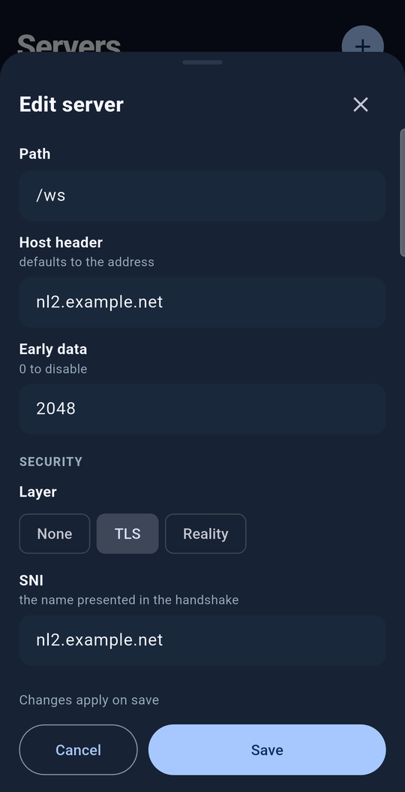
  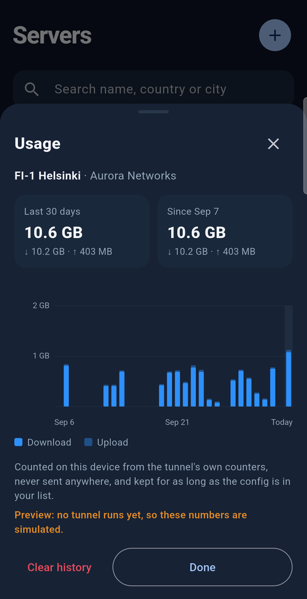

Servers are added by pasting links, scanning a QR code with the camera, reading one from a
screenshot, or filling in the form by hand. A link the app cannot run is listed with the reason,
never quietly turned into something else.

  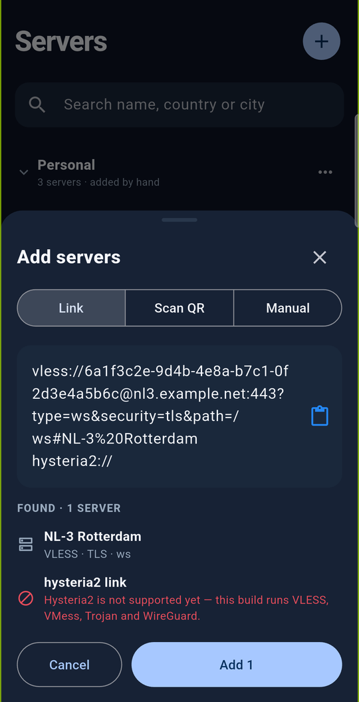

### Settings

Bypass rules (domains, addresses and ranges that stay off the tunnel), DNS, the ad blocker and
anti-tracker, diagnostics with the app's own log, and how to support the project. Settings are read
when the tunnel starts, so they lock while connected rather than look applied when they are not.

  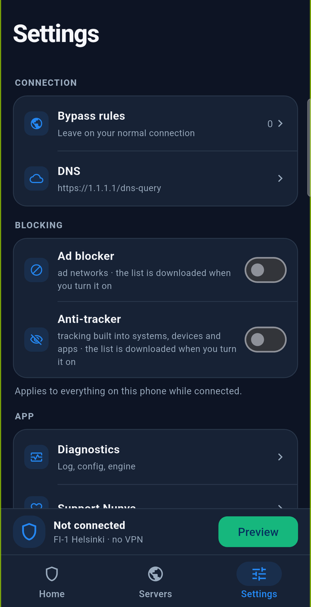
  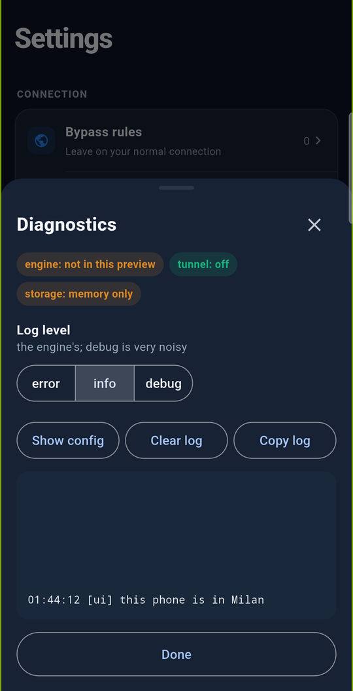

## Privacy

- **No account, no telemetry.** Servers stay on the phone.
- **One kind of network request.** As the desktop app does, the preview asks public geo-IP services
  (ipwho.is, ipinfo.io, api.ip.sb) for the phone's own address and place, to put it on the map. It
  never asks while a tunnel is up, since the answer would be the exit.
- **The log never holds a secret.** It names servers and places, never addresses, links or keys,
  because logs get pasted into public issues.
- **Permissions on Android:** internet, camera (for scanning, and optional), and network state.
  The camera library's microphone and storage permissions are removed.

## Building

With [Flutter](https://docs.flutter.dev/get-started/install) installed, from this directory:

| Task | Command |
| --- | --- |
| Get packages | `flutter pub get` |
| Check | `flutter analyze` |
| Test | `flutter test` |
| Run on Android | `flutter run -d <android-device>` |
| Run on iOS | `flutter run -d <ios-device>` (macOS, with Xcode and signing) |

Every dependency is open source and pinned, so the Android app can be built from source for
F-Droid: QR codes are drawn with `qr` and read with `zxing2` (pure Dart, not Google's ML Kit), and
the camera and photo picker are the Flutter team's plugins.

The launcher icons are written from [`design/nonya.png`](design/nonya.png) by
`python3 scripts/icons.py` (needs Pillow); run it again when the artwork changes. The screenshots
here were taken on a phone from a build made with `--dart-define=NUNYA_SCREENSHOTS=true`, which puts
the phone in Milan at a documentation address, so no picture shows where its taker is.

## Layout

| Path | What is there |
| --- | --- |
| `lib/main.dart` | The app: Home, Servers, Settings and the state they share |
| `lib/tunnel.dart` | The one owner of connection state; the native bridge will keep its shape |
| `lib/share_link.dart` | Share links to server profiles and back (the one owner of import) |
| `lib/map_view.dart` | The world map, ported from the desktop |
| `lib/add_servers.dart`, `lib/qr_scan.dart` | Adding servers: links, QR codes, the form |
| `lib/server_sheets.dart` | Share, usage and edit |
| `lib/settings.dart`, `lib/settings_sheets.dart` | Settings, bypass rules, the log, and their sheets |
| `lib/whereabouts.dart`, `lib/usage.dart`, `lib/splash.dart` | Geo-IP placement, usage history, the launch splash |
| `android/`, `ios/` | Platform projects; the native tunnels will live here |
| [`design/`](design/README.md) | The screen designs, artwork and map data |

[CLAUDE.md](CLAUDE.md) has the working rules for changing any of it.

## Decisions so far

- **Separate from the desktop repository.** nunya stays desktop-only (macOS, Linux, Windows); the
  phone apps are here.
- **One mobile UI.** Flutter owns the shared screens and presentation state. Native services own
  tunnel setup and engine lifetime, including when the app UI is closed.
- **An Xray-based mobile engine.** AndroidLibXrayLite and libXray are candidates for Android and
  iOS respectively. Their source builds, tunnel integration, and protocol coverage need validation
  before either is pinned. The desktop `nunya-core` executable is not the mobile runtime.
- **Android is released first, through F-Droid.** It is built from source, so nothing here can
  depend on a prebuilt binary F-Droid cannot rebuild. The repository is mirrored to GitLab
  (`nunya-vpn-group`) for that.
- **iOS is built but not released yet.** A VPN app on the App Store needs an Apple Developer
  account enrolled as an organization (App Store guideline 5.4).
- **Honest about coverage.** The mobile design is VPN-only, and the app never claims to protect
  traffic that no tunnel is carrying.

## License

GPL-3.0, like nunya and nunya-core.
