# Design

Nunya on a phone, screen by screen. Each screen is shown light, then dark.

| | |
| --- | --- |
| **Tabs** | Home (the connection over the map), Servers, Settings. Bypass rules, Diagnostics and Support live in Settings. Every tab icon has a label. |
| **Touch** | Every target is 44px or more, rows are 64px, and Connect is 56px and full width, where the thumb rests. |
| **Spacing** | 16px gutters and 18–24px corners. Only the map and a selected row's tint reach the screen's edge. |
| **Type** | Titles 30/800, the state 22/800, rows 16/700 with 13 under, labels 11.5 capitals, fields 16 so the page never zooms. |
| **The connection** | On Home, a sheet over the map. On every other tab, a one-line bar above the tabs. |
| **Honesty** | In proxy mode, “only apps set to use it” stays on the sheet and the bar, closed or open. |

## Home

The map fills the screen and the connection is a sheet over it. Closed, the sheet shows the state, the server and Connect; dragged up, it shows traffic and addresses. Pinch and drag move the map; there are no zoom buttons.

**Off**

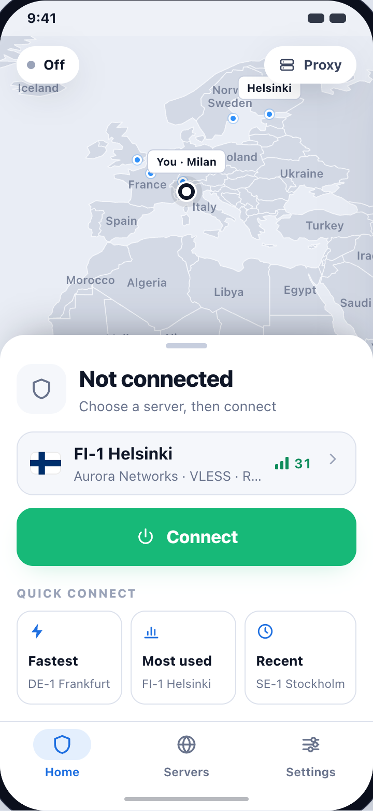 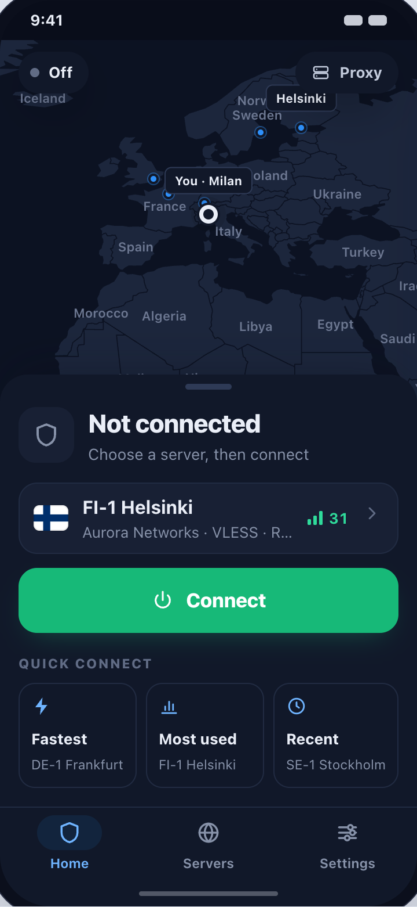

**Connecting**

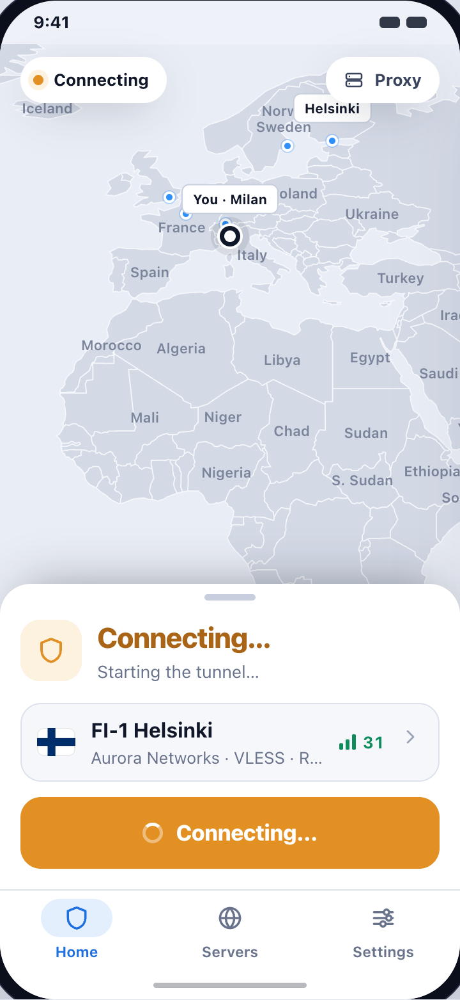 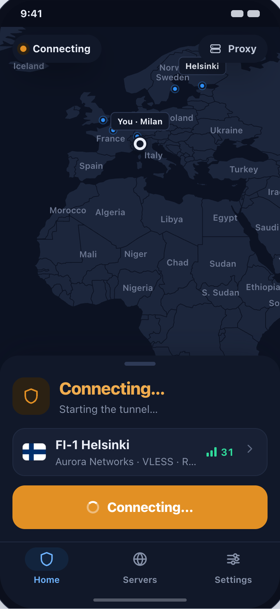

**Connected**

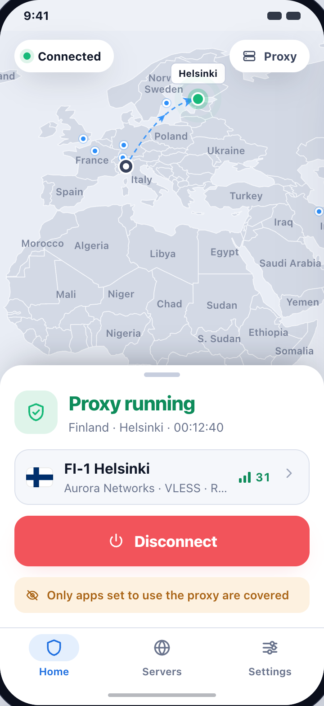 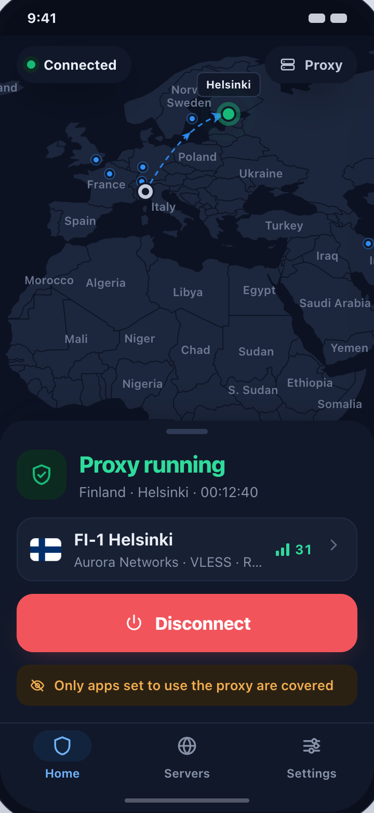

**Connected sheet dragged up**

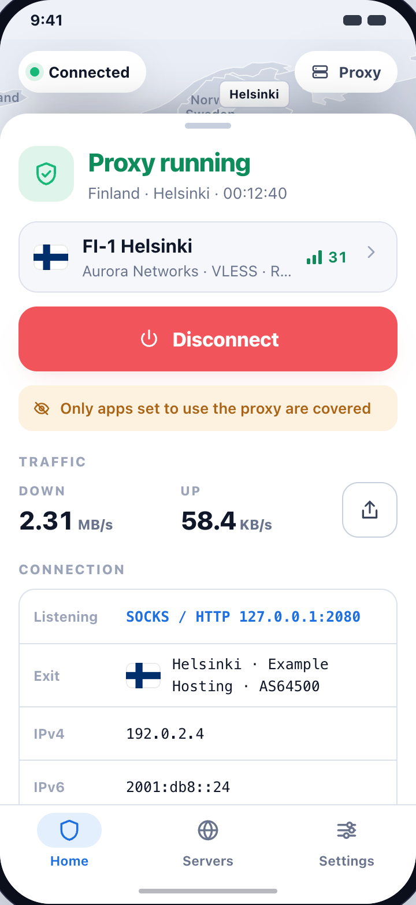 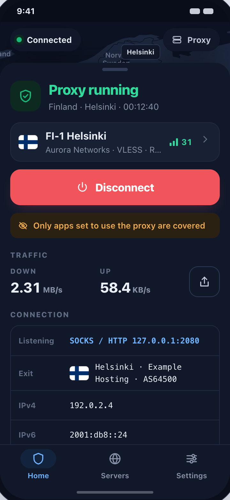

## Servers

One full-width list. The selected server is tinted edge to edge, under its own ⋯. The connection rides above the tabs, so Connect is one tap away from any row.

**Servers connected**

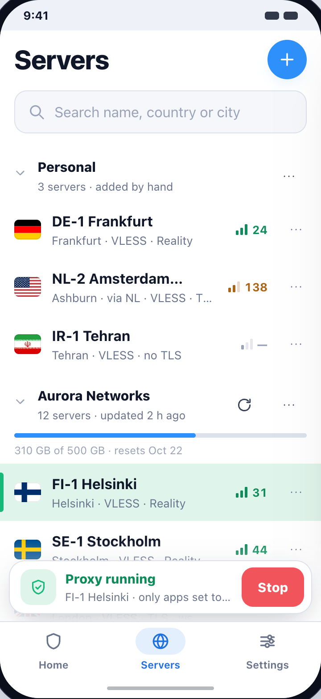 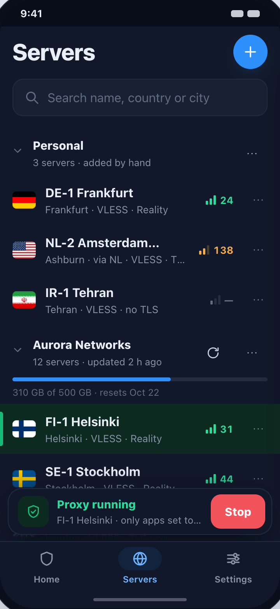

**Row actions**

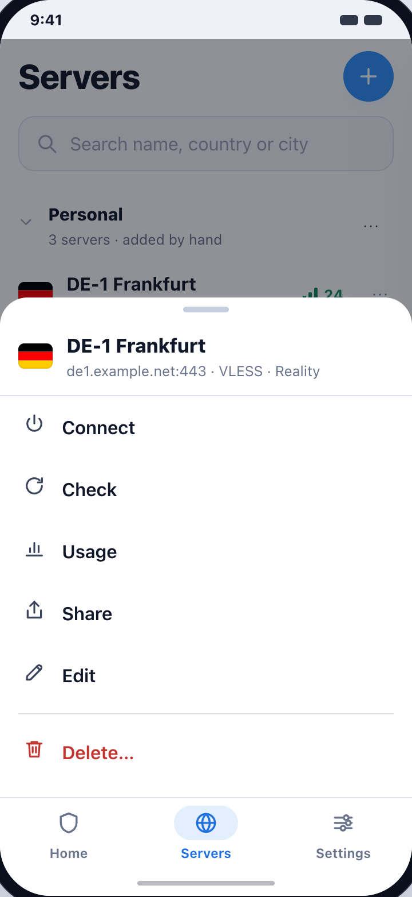 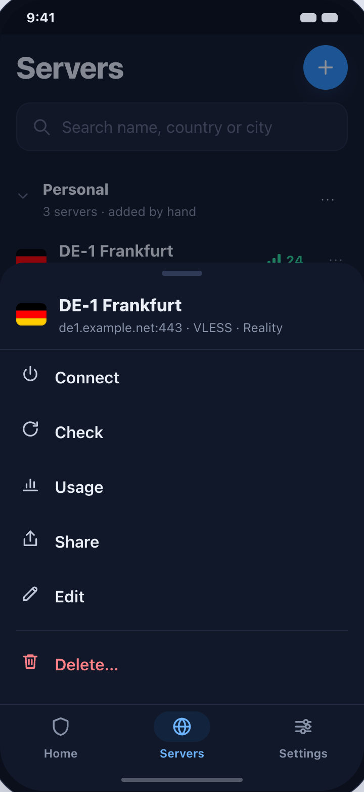

## Sheets

Everything that was a dialog on the desktop rises from the bottom, with its actions at thumb height.

**Add servers**

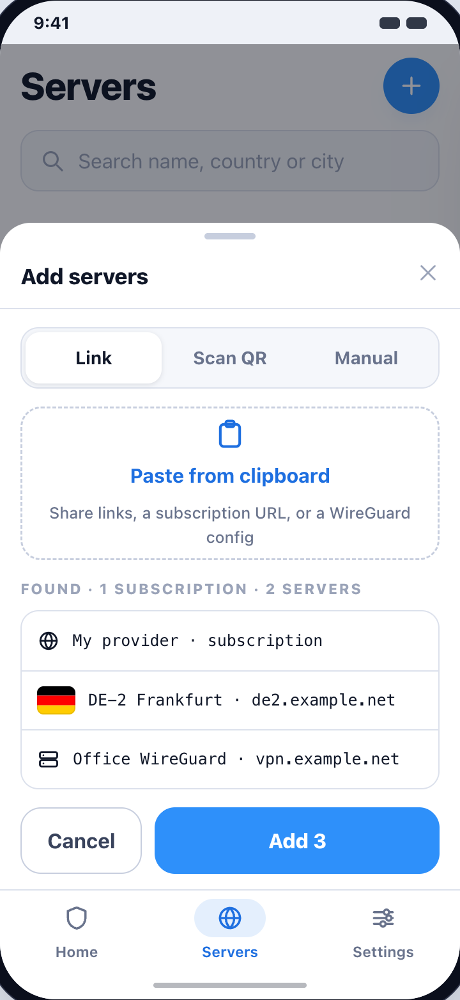 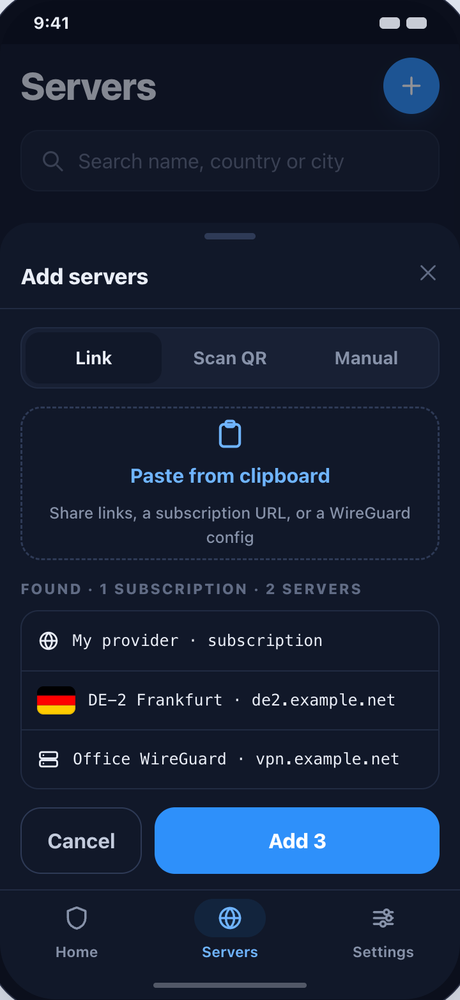

**Vpn mode before android asks**

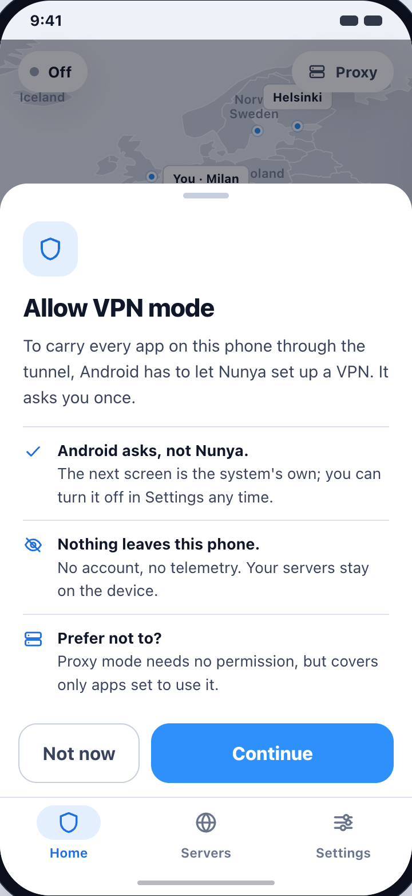 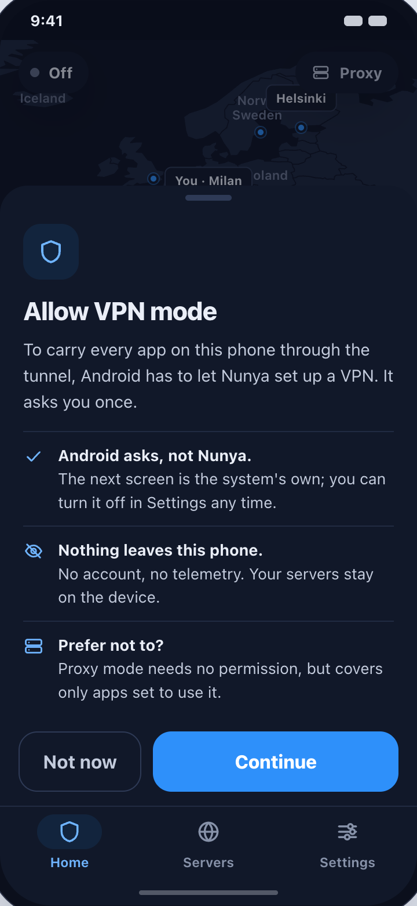

## Settings

Grouped rows. Mode is a choice between two named things, because they cover different amounts of the phone.

**Settings**

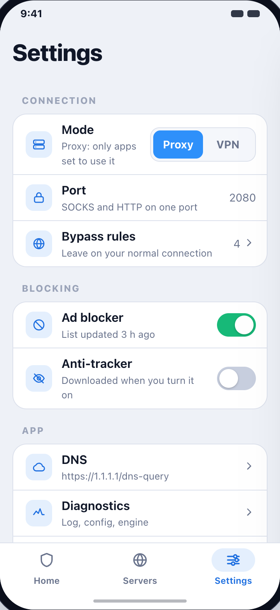 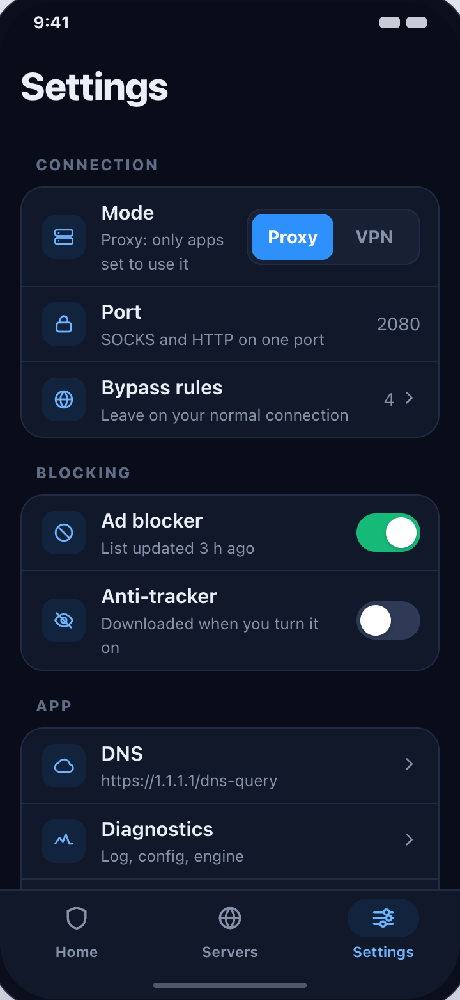

## The board

The screens were drawn from [board/](board/README.md), a page that renders each one with the desktop app's own colours, icons, flags and map. `nonya.png` is the app's artwork.
